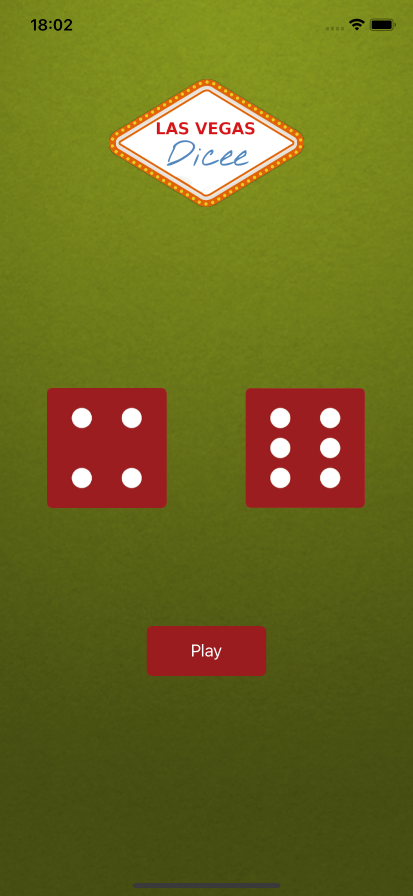

# Dicee

my first native app was built with swift using Xcode.

## WHAT IS DICE

A Las Vegas data app. You can roll the dice by pressing a button or shaking your phone. With this app in your pocket, you'll be fully prepared to beat any score on the go!

## What I've learned

* How to clone an existing Xcode project from GitHub.
* Create an app with behavior and functionality.
* Create links between Interface Builder files and code using IBActions and IBOutlets.
* Get familiar with the Xcode code editor.
* * Learn to use comments to annotate code.
* Understand and use Swift constants and variables.
* Understand and use collection types such as Swift arrays.
* Test and debug your application with the Xcode console.
* Learn about randomization and how to generate random numbers in Swift.

